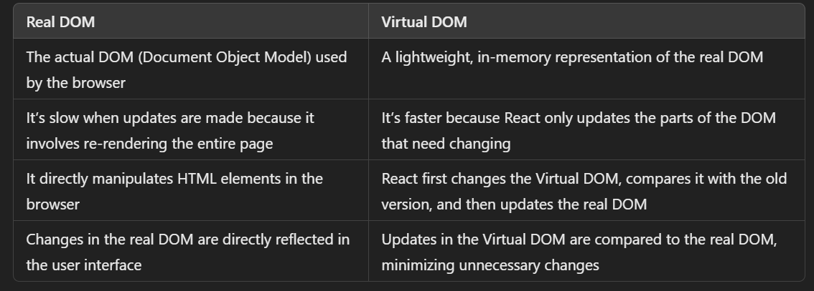
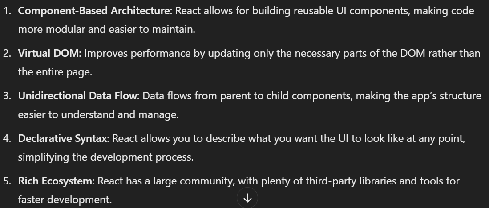
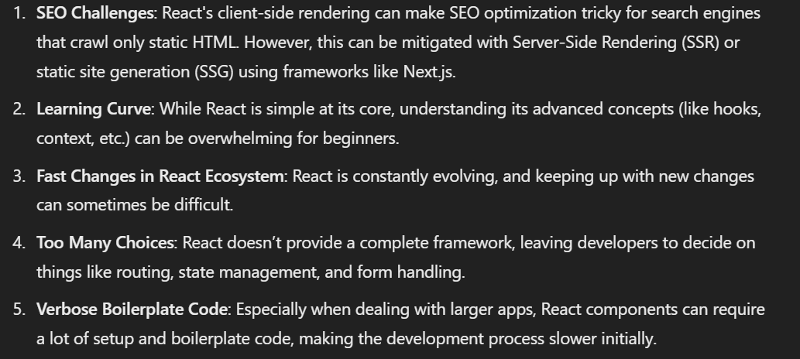
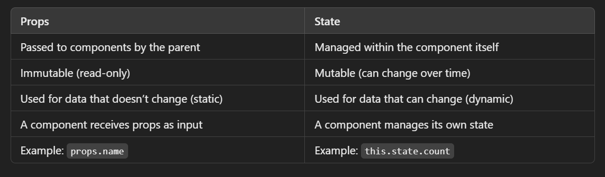

# que.1 explain the working of  vertual dom?
## Ans.1 :
- The Virtual DOM (VDOM) is a lightweight representation of the actual DOM (Document Object Model). React uses VDOM to optimize rendering performance by minimizing direct manipulations with the actual DOM.

## Here’s how the Virtual DOM works:

- Rendering Process: When the state or props of a React component change, React first updates the Virtual DOM. The Virtual DOM is just an in-memory object that mirrors the real DOM structure.

- Reconciliation: React compares the current Virtual DOM with a previous version (using a diffing algorithm) to identify what has changed.

- Updating the Real DOM: Once React knows what changed, it updates only those specific parts of the real DOM. This process is much faster than re-rendering the entire real DOM.

- Batch Updates: React batches the updates to the real DOM in an optimized way to reduce unnecessary reflows and repaints.

-By using the Virtual DOM, React can efficiently manage UI changes and improve performance by reducing the direct DOM manipulation overhead.

# qu2. difference between read dom and virtual dom?


# que.3 Advantages of React?
-React offers several advantages:



- 6.JSX: JSX syntax allows HTML and JavaScript to coexist in the same file, making it easier to write and understand UI code.

# que.4 Limitations of React?
- Some limitations of React include:



# que.5 Can Browser Read JSX Directly?
- No, browsers cannot read JSX directly because JSX is not a standard JavaScript syntax. JSX is a syntactic sugar that combines JavaScript and HTML-like syntax. Before it can run in a browser, JSX must be transpiled into JavaScript using a tool like Babel. Babel converts JSX into React.createElement() calls, which the browser can understand.

# que.6 What is State in React and How Is It Used?
- State in React is an object that holds dynamic data for a component. It allows a component to manage its internal data and re-render when that data changes.

## How to use State:
- State is a special object in React that holds data about the component. It represents the component's local data or status and can change over time, typically in response to user actions or events.
- Declare state using the useState hook (for functional components) or the this.state object (for class components).
Update the state using the setState() method (in class components) or the updater function from useState (in functional components).

```
import React, { useState } from 'react';

function Counter() {
  const [count, setCount] = useState(0); // State initialization

  const increment = () => setCount(count + 1); // Updating state

  return (
    <div>
      <p>Count: {count}</p>
      <button onClick={increment}>Increment</button>
    </div>
  );
}
```

# que.7 How Can You Update the State of a Component?
## You can update the state of a component in two ways:
### For Functional Components (using useState hook):

- Use the state setter function returned by useState.
```
const [count, setCount] = useState(0);
setCount(count + 1); // Update state
```
### For Class Components:

- Use the setState() method to update the state.
```
this.setState({ count: this.state.count + 1 });
```
- React will trigger a re-render whenever state changes, ensuring the component reflects the updated data.

# que.8 What Are Props in React?
- Props (short for "properties") are used to pass data from a parent component to a child component in React. Props allow you to make components reusable and dynamic by passing different data to them.
```
function Greeting({ name }) {
  return <h1>Hello, {name}!</h1>;
}

function App() {
  return <Greeting name="Alice" />;
}
```

# que.9 Difference Between Props and State?


# que.10 What Are the Different Phases of React Component Lifecycle?
## React components have three main lifecycle phases:

- Mounting: When a component is being created and inserted into the DOM.

- Methods: constructor(), getDerivedStateFromProps(), render(), componentDidMount()
Updating: When a component is being re-rendered as a result of state or props change.

- Methods: getDerivedStateFromProps(), shouldComponentUpdate(), render(), getSnapshotBeforeUpdate(), componentDidUpdate()
Unmounting: When a component is being removed from the DOM.

- Methods: componentWillUnmount()
In functional components, lifecycle methods are replaced by hooks like useEffect for side effects and useState for state management.

